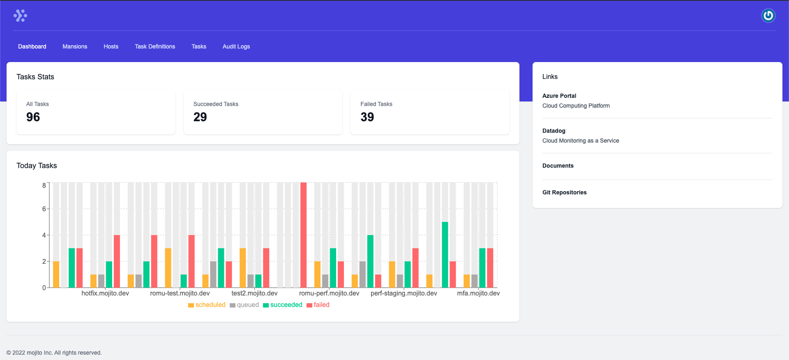
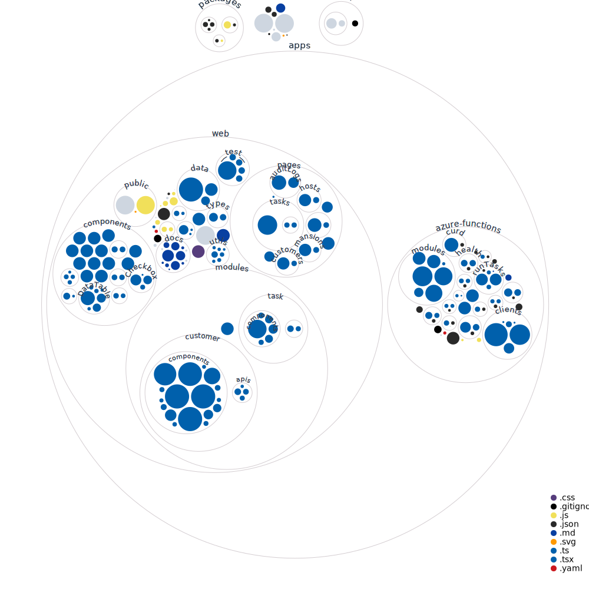

# Mojito Admin

> An admin app for SaaS companies that are using Microsoft Azure Cloud.


[](https://twitter.com/ThaddeusJiang)

## Features

- [x] Create services(trial account/real account) for customers
- [x] Manage services
- [x] Schedule and monitor cron jobs
- [x] Domain Status
- [ ] Download Audit logs



## Options

- [x] Operate Cloud Resources via Web App
- [x] Operate Cloud Resources via Terraform

## Involved content

1. Next.js
2. Azure Functions
3. Terraform
4. GitHub Actions
5. Datadog

## Step1: Create Azure Cosmos DB and Function App

1. setup `test` environment, see [./infra/azure/test/main.tf](./infra/azure/test/main.tf)

```
cd infra/test
terraform init
terraform plan -out=test
terraform apply "test"
```

2. setup `prod` environment with the same way

## Step2: Deploy Web App to Vercel and deploy to Azure

1. deploy `test` when merge PR into dev branch and push commit to dev branch, see [./.github/workflows/deploy-test.yml](./.github/workflows/deploy-test.yml)

2. deploy `prod` when publish a release, see [./.github/workflows/deploy-prod.yml](./.github/workflows/deploy-prod.yml)

## File Structure

```
.
├── .github
│   └── workflows
├── .secrets.baseline       // Run Yelp's detect-secrets
├── .vscode
│   ├── extensions.json
│   ├── launch.json         // debug and deploy
│   ├── settings.json
│   └── tasks.json
├── LICENSE
├── README.md
├── apps
│   ├── azure-functions     // functions
│   └── next-app            // web
├── infra
│   └── azure               // infra as code
├── packages
│   ├── eslint-config-custom
│   ├── tailwind-config
│   └── tsconfig
└── turbo.json
```

this?

repo-visualizer

This diagram of using the [repo-visualizer](https://github.com/githubocto/repo-visualizer) GitHub Action.


