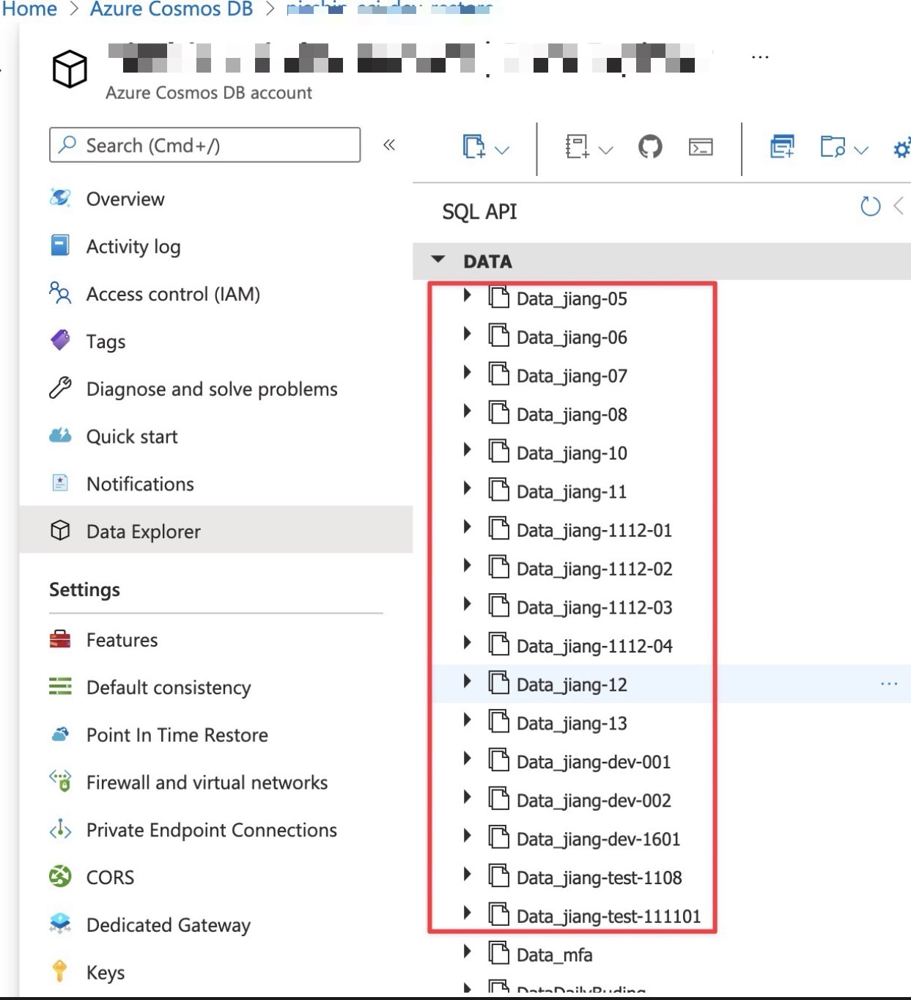

# deleteCosmosContainers

- [deleteCosmosContainers](#deletecosmoscontainers)
  - [Before and After](#before-and-after)
  - [How to use?](#how-to-use)
  - [What tools used?](#what-tools-used)

## Before and After

before:

after:

## How to use?

goto [deleteCosmosContainers.http](./deleteCosmosContainers.http)

click `Send Request`

## What tools used?

[REST Client Extension for Visual Studio Code](https://github.com/Huachao/vscode-restclient)
