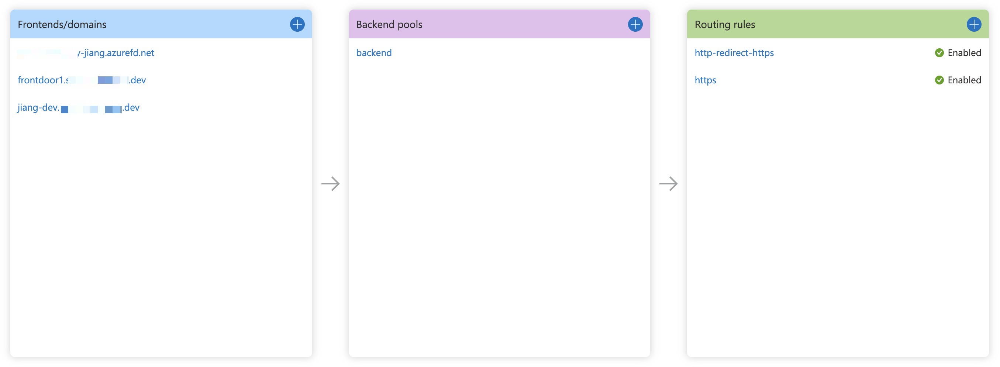

# Manage Azure Front Door with Terraform

Result



## 背景

SaaS 业务多采用“多租户模式”，所以不同 Frontends 其实使用的是同一个 Backend (aka App Service)。

## 特殊处理

1. 处于安全角度考虑，系统只允许 HTTPS，所以需要额外配置一个 Routing rule (http-redirect-https) 重新向 http 请求。

```
  routing_rule {
    name               = "http-redirect-https"
    accepted_protocols = ["Http"]
    patterns_to_match  = ["/*"]
    frontend_endpoints = ["frontdoor1", "jiang-dev"]
    redirect_configuration {
      redirect_protocol = "HttpsOnly"
      redirect_type     = "Found"
    }
  }
```
